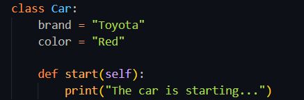
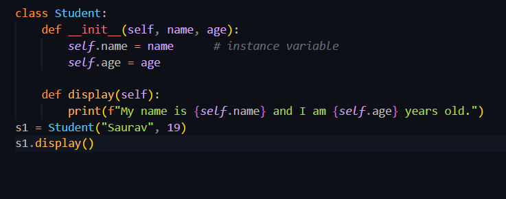

#  Python: Class, Object, self, and __init__
## Class
a class is like a plan or blueprint for making objects which tells what data variables and functions an object will have.

## Object
an object is something we make from a class which is just like using a blueprint to build.

## self
self means this object or itself that represnets to the current object we are currently working on.

## __ init__
init method is a special function that runs automatically when you create a new object. 
we use it to give values to the object when its made.

