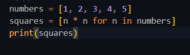
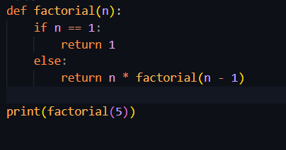

# Inheritance

## Why is there no public, private or protected modifier ?
because in C#, inheritance is always public (you can’t hide the base class).

# List comprehension
List comprehension is a short and clean way to create a new list from another list (or any iterable) — in a single line.

Instead of writing a full loop, you can do it in one neat line.

# Recursion
Recursion is when a function calls itself to solve a smaller part of a problem.

its like a loop using functions — but the function keeps calling itself until a base (stop) condition is reached.

